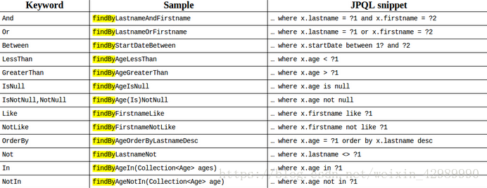

#TransformationSQL

###（一）框架支持：
* 针对两种前端请求方式： GET / POST
* 针对日期问题处理
* 支持分页
* 对FindBy语法条件的全部支持，说明如下：
  


###（二）前端发送伪SQL条件规则说明：  
对于上述图片的条件支持：  
以下为条件片段的连接词：
* And
* Or

以下需要有Key -- Value同时存在：
* LessThan
* GreaterThan
* Like
* NotLike
* In
* NotIn
* Not

以下需要有Key -对应- 两个Value存在：
* between


以下只需要Key
* IsNull
* IsNotNull,NotNull
* OrderBy

框架对上述扩展分页和相等条件 （FindBy注重的是条件 相等条件已经在其内部拼接好）
* Page  Eg:x,y x->pageNo,y->pageSize  pageNo从1开始
* eq 

###（三）暂不支持多表联合查询

###（四）业务术语
* 条件碎片：  
```java
   * eq_name='xxx'
   * isNotNull_name
   * like_name='xxx'
   条件碎片构成：Opt：操作符           （必须）
                Field：字段名称       （必须）
                Value：字段数据       （不是必须）
```

###（五）如何使用  
```java
    查看 ./src/test/java/com/demo/IntegrateTest.class
```
